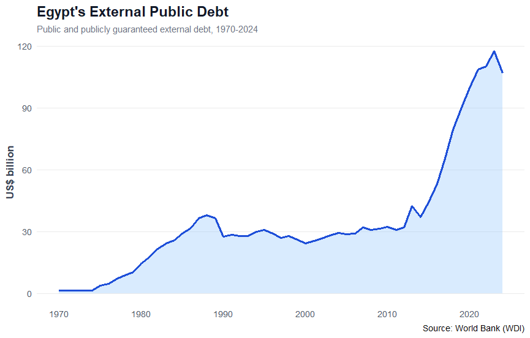
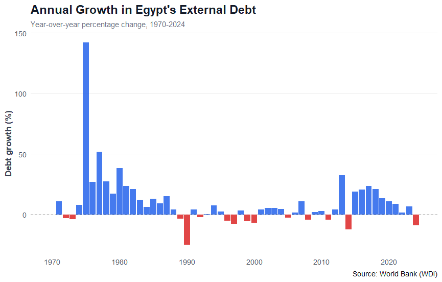
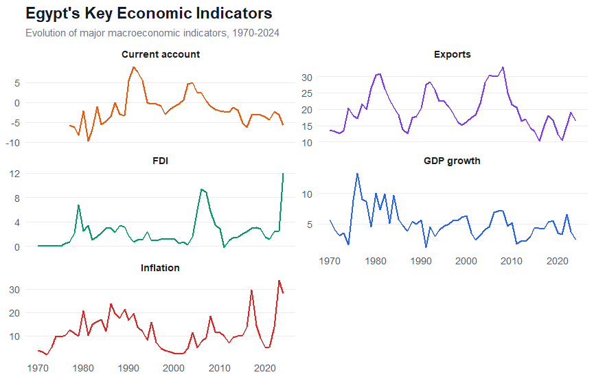
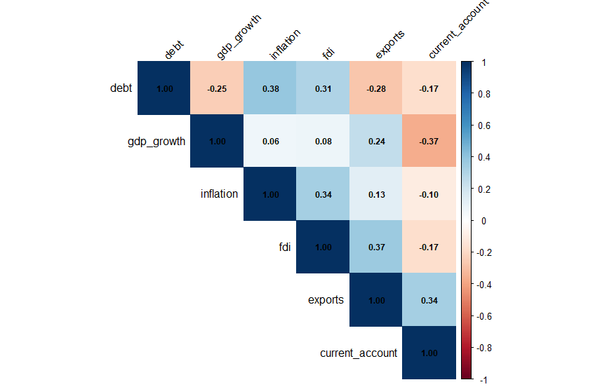
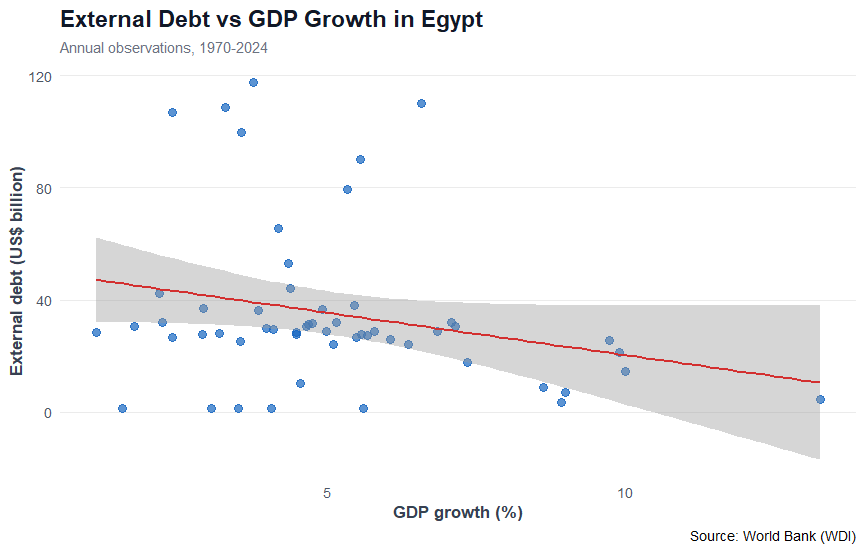
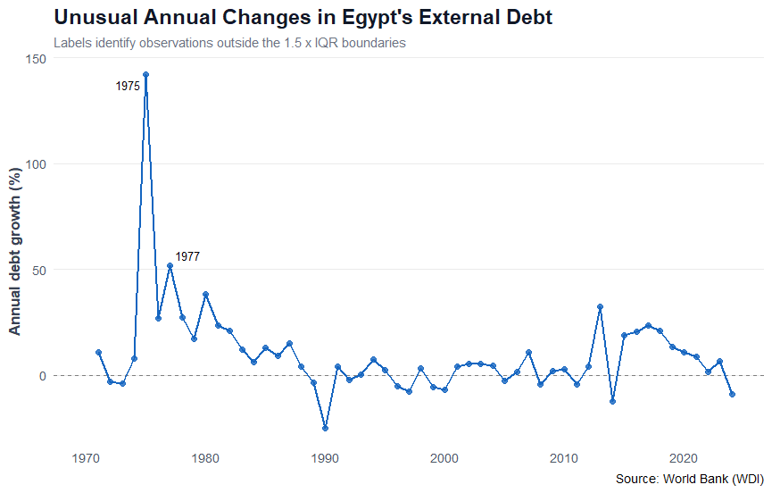

# Egypt External Debt Analysis 🇪🇬

## Macroeconomic Factors Associated with Egypt's External Debt Dynamics

This project analyzes the evolution of Egypt's external public debt and investigates its relationship with selected macroeconomic indicators using exploratory data analysis and regression modeling in R.

The analysis covers the period **1970–2024** using data from the **World Bank – World Development Indicators (WDI)**.

---

## Research Question

> **Which macroeconomic factors are associated with changes in Egypt's external public debt?**

The analysis focuses on three main questions:

- How has Egypt's external debt evolved over time?
- How volatile has annual debt growth been?
- Which macroeconomic indicators are statistically associated with changes in external debt?

---

## Data Source

**Source:** World Bank – World Development Indicators (WDI)

**Country:** Egypt

**Period:** 1970–2024

The analysis includes the following variables:

| Variable | Description |
|---|---|
| External Debt | Public and publicly guaranteed external debt |
| Debt Growth | Annual percentage change in external debt |
| GDP Growth | Annual GDP growth rate |
| Inflation | Annual inflation rate |
| FDI | Foreign direct investment |
| Exports | Exports of goods and services |
| Current Account | Current account balance |

---

# Exploratory Data Analysis

## 1. Evolution of Egypt's External Public Debt



Egypt's external public debt followed distinctly different historical phases.

Debt remained relatively low during the early 1970s before increasing substantially through the late 1970s and 1980s. During much of the 1990s and 2000s, the debt stock was comparatively stable.

A major change appears from the mid-2010s, when external debt began increasing rapidly and eventually reached its highest level near the end of the observation period.

The latest observation shows a decline after the historical peak.

This pattern suggests that Egypt's external debt trajectory is characterized by periods of **expansion, stabilization, and renewed acceleration**, rather than constant growth.

---

## 2. Annual Growth in External Debt



Annual debt growth shows considerable variation across the sample.

The 1970s contain some exceptionally large increases in external debt, while several later periods experienced negative annual growth.

From the mid-2010s, Egypt entered another period of sustained positive debt growth, although the pace gradually moderated in subsequent years.

The latest observation shows a decline in the external debt stock.

Analyzing the annual growth rate is important because the level of debt alone does not capture the volatility and changing pace of debt accumulation.

---

## 3. Key Macroeconomic Indicators



The macroeconomic indicators themselves show substantial variation over the 1970–2024 period.

The data highlight changing patterns in:

- Current account balances
- Export performance
- Foreign direct investment
- GDP growth
- Inflation

These movements provide the broader macroeconomic context for examining changes in external debt.

---

## 4. Correlation Analysis



The correlation matrix shows mostly **weak-to-moderate pairwise relationships** between external debt and the selected macroeconomic indicators.

External debt is:

- Positively correlated with **inflation (0.38)**
- Positively correlated with **FDI (0.31)**
- Negatively correlated with **exports (-0.28)**
- Negatively correlated with **GDP growth (-0.25)**
- Negatively correlated with the **current account balance (-0.17)**

Some moderate relationships also exist among the explanatory variables themselves.

For example:

- GDP growth and current account balance: **-0.37**
- FDI and exports: **0.37**
- Exports and current account balance: **0.34**

These correlations are descriptive and should not be interpreted as causal effects.

A multiple regression model is therefore used to examine the relationships between macroeconomic variables and annual debt growth when the variables are considered jointly.

---

## 5. External Debt and GDP Growth



The scatterplot suggests a negative relationship between the level of external debt and GDP growth.

However, the observations are widely dispersed around the regression line, indicating considerable variation that cannot be explained by GDP growth alone.

This visual relationship should therefore be interpreted cautiously.

It provides exploratory evidence of an association, but does not establish that higher GDP growth causes lower external debt.

---

## 6. Unusual Annual Changes



Potential unusual observations in annual debt growth were identified using the **1.5 × IQR rule**.

The analysis identifies particularly large debt-growth observations in:

- **1975**
- **1977**

These years display annual changes substantially above the typical range of observations.

Identifying these observations is important because extreme values can influence summary statistics and regression estimates.

They are therefore treated as economically meaningful observations that require interpretation rather than being automatically removed from the dataset.

---

# Regression Analysis

## Simple Regression

A simple regression was first estimated to examine the relationship between annual debt growth and GDP growth.

The model showed a statistically significant positive association between GDP growth and annual external debt growth.

**GDP Growth coefficient:** approximately **3.85**

**p-value:** approximately **0.002**

**R²:** approximately **0.17**

This suggests that GDP growth alone explains around 17% of the variation in annual debt growth within the available sample.

However, the relationship changes once additional macroeconomic factors are included.

---

## Multiple Regression

The following model was estimated:

**Debt Growth = GDP Growth + Inflation + FDI + Exports + Current Account Balance**

The multiple regression used approximately **48 annual observations**.

### Model Performance

- **R²:** 0.325
- **Adjusted R²:** 0.245
- **Overall model p-value:** 0.004

The model is statistically significant overall and explains approximately **32.5% of the variation in annual external debt growth**.

---

## Regression Results

| Variable | Coefficient | Statistical Interpretation |
|---|---:|---|
| GDP Growth | — | Not statistically significant after controlling for other variables |
| Inflation | — | Not statistically significant |
| FDI | -1.65 | Borderline statistical significance |
| Exports | — | Not statistically significant |
| Current Account Balance | -1.86 | Statistically significant |

The **current account balance** is the strongest statistically significant predictor in the model.

Its negative coefficient indicates that improvements in the current account balance are associated with lower annual external debt growth, holding the other variables constant.

FDI also shows a negative relationship with debt growth and is close to conventional statistical significance.

GDP growth, despite appearing significant in the simple regression, loses statistical significance once the other macroeconomic variables are included.

This demonstrates an important analytical point:

> **A relationship observed in a simple regression may change once other relevant variables are controlled for.**

---

# Key Findings

The analysis produces several main findings:

1. **Egypt's external debt has not followed a constant growth path.**  
   The historical series contains periods of rapid expansion, relative stability, and renewed acceleration.

2. **Debt growth is highly volatile.**  
   Some years experienced very large increases, while others recorded declines.

3. **Simple correlations do not tell the full story.**  
   Several macroeconomic indicators have weak-to-moderate correlations with external debt.

4. **GDP growth appears significant when analyzed alone but not in the multiple regression.**

5. **The current account balance emerges as the strongest statistically significant macroeconomic variable associated with annual debt growth.**

6. **The multiple regression explains only part of debt-growth variation.**  
   This suggests that additional economic, financial, institutional, and external factors may also play important roles.

---

# Interpretation

The results should be interpreted as **statistical associations rather than causal relationships**.

External debt decisions depend on many factors that cannot be fully represented by a small set of annual macroeconomic indicators.

These may include:

- Exchange-rate movements
- Global interest rates
- Government financing requirements
- International lending programs
- Foreign reserves
- Fiscal deficits
- Major economic shocks
- Political and institutional factors

The purpose of this project is therefore not to claim that one variable "causes" Egyptian external debt, but to demonstrate how statistical analysis can be used to investigate macroeconomic relationships systematically.

---

# Limitations

Several limitations should be considered:

- The dataset contains a relatively small number of annual observations.
- Historical macroeconomic relationships may change across different economic periods.
- Extreme observations may affect regression estimates.
- The analysis does not establish causality.
- Relevant variables such as exchange rates, fiscal deficits, interest rates, debt-service costs, and foreign reserves are not included in the current model.
- Some relationships may be affected by structural changes in Egypt's economy over the 1970–2024 period.

Future analysis could incorporate additional variables, structural-break analysis, lagged relationships, and time-series methods.

---

# Tools Used

- **R**
- World Bank WDI data
- Data cleaning and transformation
- Exploratory Data Analysis
- Data visualization
- Correlation analysis
- IQR-based outlier detection
- Simple linear regression
- Multiple regression

---

# Repository Structure

```text
Egypt-external-debt-analysis/
│
├── README.md
│
├── egypt_external_debt_analysis.R
│
└── plots/
    ├── correlation_plot.png
    ├── egypt_annual_growth.png
    ├── egypt_debt_growth.png
    ├── egypt_debt_vs_gdp.png
    ├── egypt_key_economic_indicators.png
    └── unusual_annual_changes.png
